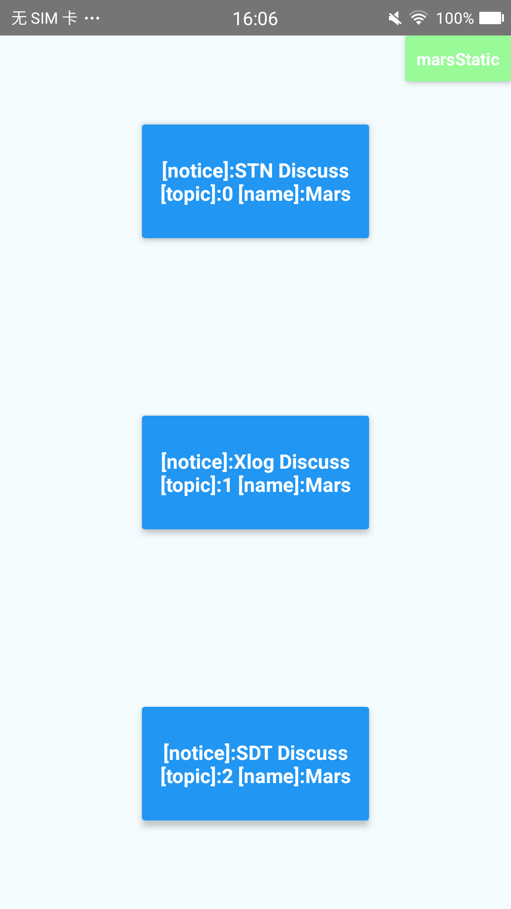
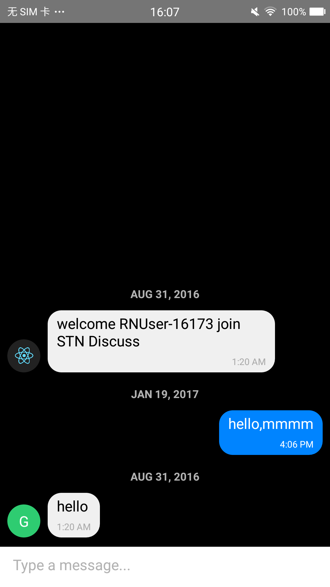
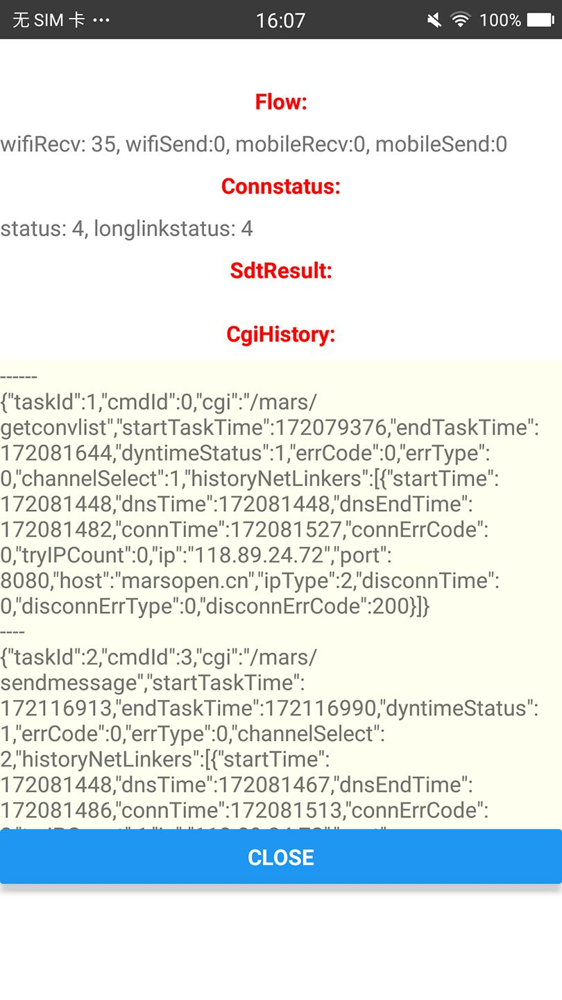

# react-native-mars
	
### Mars-tencent-Samples-Demo






### Download Apk


### Start Mars-tencent-Samples from source
```
    git clone https://github.com/Caijiacheng/react-native-mars.git
    cd modules/core/examples/mars-tencent
    npm install 
    cd ../android && ./gradlew assembleRelease
    adb install ./app/build/outputs/apk/app-release.apk
```


## TODO:
- [x] React Native sample Android [Mars] (https://github.com/Tencent/mars)
- [ ] React Native sample Ios [Mars](https://github.com/Tencent/mars)
- [ ] mars-live-adapter to support [ParseServer](https://github.com/ParsePlatform/parse-server)
- [ ] mars-XHR-adapter to support [ParseJS](https://github.com/ParsePlatform/Parse-SDK-JS)

## REF:
- [react native xlog](https://github.com/EngsShi/react-native-xlog)
	
	